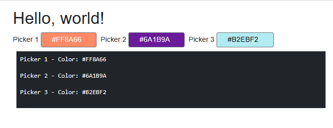

# Blazr.ColorPicker

This repo is based on the following Repo - [Blazor-Color-Picker](https://github.com/tossnet/Blazor-Color-Picker/tree/master).  All rights are recognised.

The original code has been reworked into an `InputBase` derived component with binding.

Using it is now as simple as:

```csharp
    <ColorPicker @bind-Value="picker.Color" ShowColorCodeInButton />
```

